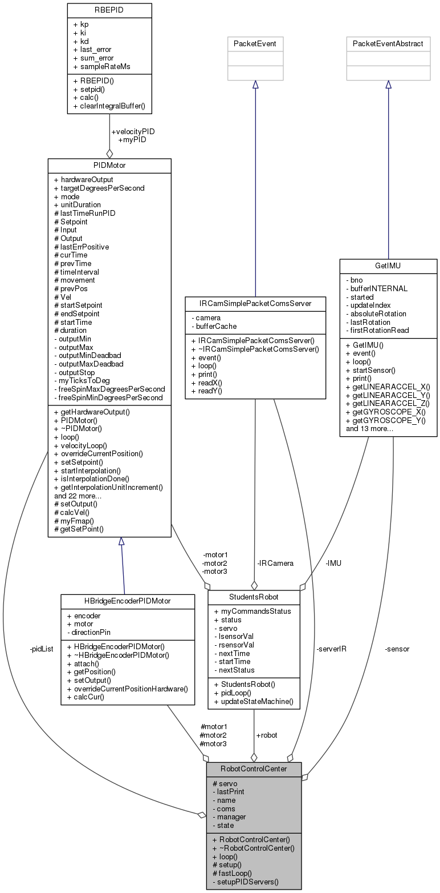
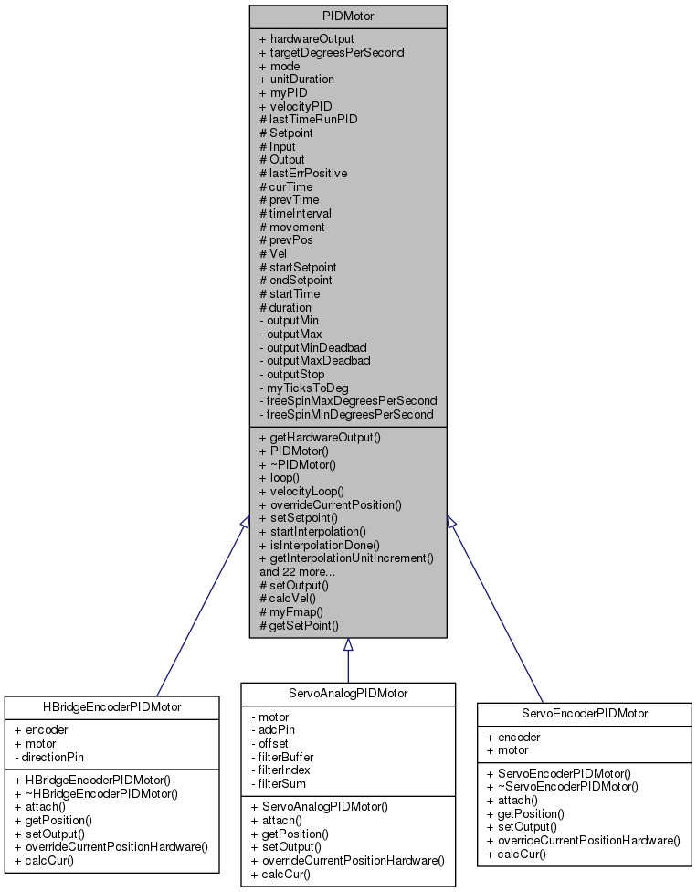

# RBE2001_template

Template code for the RBE 2001 final project

# Code Documentation Doxygen

In you checked out code, open doc/html/annotated.html to see the Doxygen documentation. The best way to understand this code is to start in the Files section of the documentation, and look at the .ino file. Look at the setup and loop call graphs.

# Base Bot CAD

Source https://github.com/WPIRoboticsEngineering/RBELabCustomParts/blob/master/WheelModule.groovy

STL's https://github.com/WPIRoboticsEngineering/RBELabCustomParts/releases/download/0.0.2/2000BaseRobot.zip

# Hardware Electrical Documentation

See: https://github.com/WPIRoboticsEngineering/RobotInterfaceBoard


## A note about the level shifter
It is important to make sure the red connection (3.3v) is attatched to the level shifter. Omitting this connection can damage your esp32. Check Twice!

# Arduino Setup and Development Computer Options 

See: [Development Computer Options](https://github.com/WPIRoboticsEngineering/RobotInterfaceBoard#development-computer-options)

# Where Is My Code?

Your privete Repository has been created for you here: https://github.com/RBE200x-lab

You and your team members should find your repository made with the template code in there. 


# Develop Code for your project

## (Optional) Install Eclipse on Personal Machine

 [See Eclipse install instructions in InstallEclipse.md](https://github.com/WPIRoboticsEngineering/RobotInterfaceBoard/blob/master/InstallEclipse.md)

## Clone your project
You may either 

Use [Arduino IDE and Github Desktop](https://github.com/WPIRoboticsEngineering/RobotInterfaceBoard/blob/master/UseArduinoGithubDesktop.md)

or
 
(Optional) Use Eclipse [using the Eclipse instructions](https://github.com/WPIRoboticsEngineering/RobotInterfaceBoard/blob/master/UseEclipse.md)

# Code theory, structure and what to edit

If find yourself saying:
 
```
Geez, thats a lot of code :/ I dont even know where to begin...
```
then start here.

The first thing to dig into is not the code, but the documentation. The template code that you all got copies of is documented using [Doxygen](https://mesos.readthedocs.io/en/latest/c++-style-guide/) a code auto-documentation tool. It generates a rather nice website of hyperlinked documentation of all the code in this repository. Besides the normal text based documentation, it also will generate very nice graphs such as

Include graphs (what headers include other headrs):

 

function call graphs (what function calls other functions):


and collaboration graphs (what data structures contain other data structures):



To access the full documentation, after cloning the code to your disk, open the doc/html/annotated.html file to start. Opening any of the .html files will get you into the mini website as well. This web site is all the code you will have access to while working on your robot. 

There are only 2 classes you need to edit to do all of your labs,  StudentsRobot and RBEPID. Use the Doxygen to search for them and navigate the Doxygen pages to learn about what these 2 classes are and how the code uses them. 

PIDMotor is a helper class that you will use but not have to modify (unless you want to, then go for it!). This class will use your PID implementation (it is defaulted to a simple p controller). It provides helper functions and structure for your PID controller. This class is also used by the communication layer to view and edit the PID controller from Java. PIDMotor has 3 subclasses



HBridgeEncoderPIDMotor wrapps the ESP32Encoder and an h-Bridge control using ESP32PWM and digitalWrite().

ServoEncoderPIDMotor wrapps the ESP32Encoder and the ESP32Servo objects.

ServoAnalogPIDMotor wrapps the ESP32Encoder and the ADC module.

Both classes can be used interchangably using the methods in PIDMotor. You can set setpoints using startInterpolationDegrees, or set the motor to run at a velocity using setVelocityDegreesPerSecond. You can read the position of the motor using getAngleDegrees and its velocity using getVelocityDegreesPerSecond.  Use the Doxygen pages to look up usage information. 

Your robot's program will go in StudentsRobot. This class will get passed the PIDMotor objects to attach. This class will then be passes those same objects again each time the loop is called via the pidLoop method. After each pidLoop, the updateStateMachine is called and the motor objects are passed in.  


Your PID code will go in RBEPID. You will implement a PID controller in one of your labs and tune it for your robots motors. By default there is a simple P controller in the compute function. Note that you will need to implement both calc and clearIntegralBuffer. 

'config.h' contains all of the pin definitions and the name of the robot. You should not change any of the pin definitions. You can add other pin definitions in header for the Final project, but do not change the pre-defined values. You should change TEAM_NAME to match your team number before using WiFi. 

### Commands

Commands from Java are sent over the WiFi. For the WiFi to work the computer running the Java application and the ESP32 need to have the same subnet. This means out of the 4 number IP address printed by the ESP32's serial port when it connects:

```
WiFi connected! IP address: 192.168.1.116
```

the first 3 match the computer that the Java application is running on. The lab ESP32's are pre-configured to connect to the special FI103-Robots Wifi network, putting htem on the same subnet as the lab computers and any conputer plugged into the spare ethernet cables on the benchtops. NOTE WPI-Wireless is a *different* subnet and they will not be able to talk to each other.  

To search for your device, type the name you set in your .ino file. Use the control application to search for that device. If it finds it, it will open up the controls and you can send commands from the Java application to your robot. Those commands will call the associated method in StudentsRobot object. 

### Alternate WiFi connections using Android Phone or Home WIfi

Connecting to a hotspot or home wifi can be don with the esp32 and the serial moniter. Make sure the serial moniter is not using any line endings and open at 115200 and you can see the print statements of the core running. Type the name of the WiFi network you want to connect to into the serial send bar and once ita all there, hit enter. Wait for the WifiManager to prompt you for the password, then type that in as well and hit enter. 

Android phones hotspot mode works well. the Iphone hotspot does not work and seems to filter the communication packets out. 

### Field controller app

The field controller can be fround here:

https://github.com/WPIRoboticsEngineering/2001_Field_Controller/releases


It is a runnable .JAR file. Download it and run.  

# FAQ and Troubleshooting

See https://github.com/WPIRoboticsEngineering/RobotInterfaceBoard#faq-and-troubleshooting

